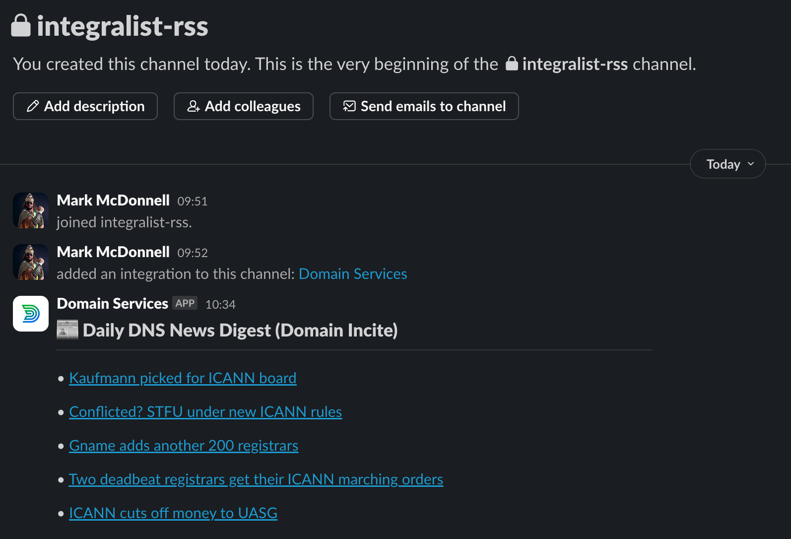

# rss-notifications

This is an experimental program that searches the environment variable
`RSS_FEED_URL` for "dns" categorised fields. It's designed to work with a
specific RSS feed but could be expanded to be adaptable to different feed
structures.

It identifies any relevant entries and then sends them in a single Slack
message (see the example program output and screenshot below).

```
2025/05/15 10:34:03 Starting Go script: Fetch and filter DNS news...
2025/05/15 10:34:03 Fetching RSS feed from: https://domainincite.com/feed
2025/05/15 10:34:04 Found DNS entry: 'Kaufmann picked for ICANN board' - https://domainincite.com/31047-kaufmann-picked-for-icann-board
2025/05/15 10:34:04 Found DNS entry: 'Conflicted? STFU under new ICANN rules' - https://domainincite.com/31045-conflicted-stfu-under-new-icann-rules
2025/05/15 10:34:04 Found DNS entry: 'Gname adds another 200 registrars' - https://domainincite.com/31038-gname-adds-another-200-registrars
2025/05/15 10:34:04 Found DNS entry: 'Two deadbeat registrars get their ICANN marching orders' - https://domainincite.com/31032-two-deadbeat-registrars-get-their-icann-marching-orders
2025/05/15 10:34:04 Found DNS entry: 'ICANN cuts off money to UASG' - https://domainincite.com/31016-icann-cuts-off-money-to-uasg
2025/05/15 10:34:04 Found 5 DNS-related articles to send.
2025/05/15 10:34:04 Sending 5 DNS entries to Slack...
2025/05/15 10:34:04 Successfully sent notification to Slack.
2025/05/15 10:34:04 Go script finished successfully.
```



> \[!NOTE\]
> At the time of writing, there were no DNS entries, so I changed the search
> term to "ICANN" instead and the above is what was returned.
